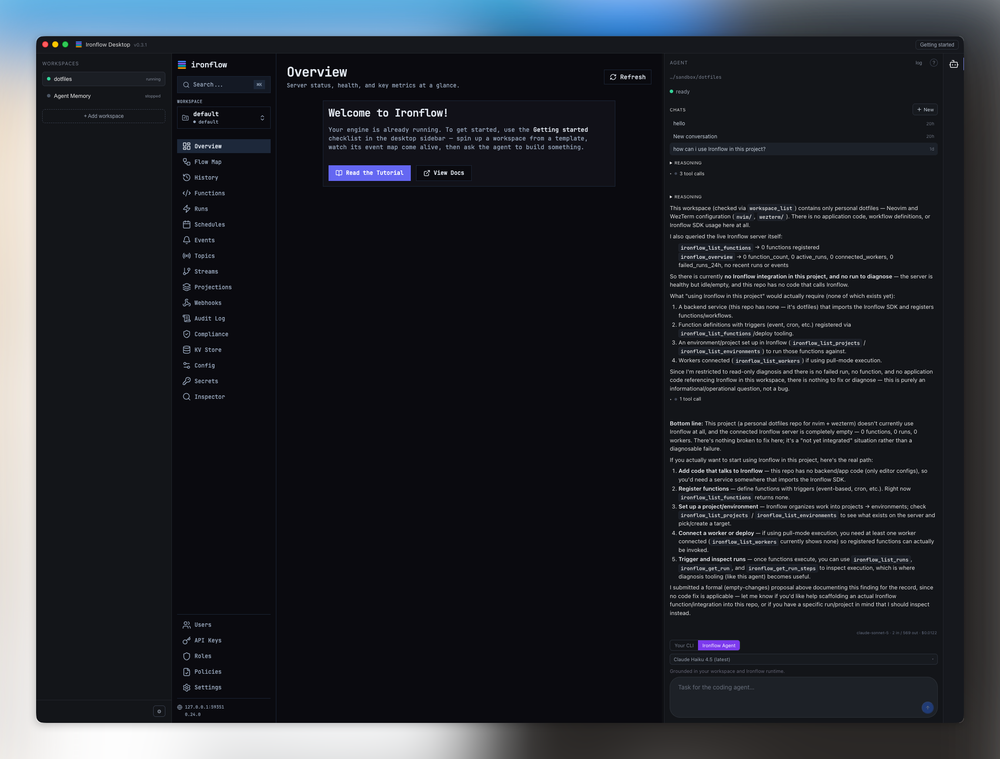

# Ironflow Desktop — Releases

Downloads for the **Ironflow Desktop** app.



- Website: <https://ironflow.run>
- Docs: <https://docs.ironflow.run>
- Getting started: <https://docs.ironflow.run/tutorials/getting-started/>
- Cloud: <https://ironflow.run/cloud/>
- All releases: <https://github.com/sahina/ironflow-desktop-releases/releases>
- **Latest release: <https://github.com/sahina/ironflow-desktop-releases/releases/latest>**

Download the installer for your OS from the **latest release** page, then follow the steps below.

> Availability by OS depends on which builds are attached to a given release. macOS (Apple Silicon) and Windows (x64) are available today; Linux builds appear on the release page as they ship.

## macOS

Apple Silicon (M1/M2/M3/M4).

1. Download `Ironflow-Desktop-<version>.dmg` (or `Ironflow-Desktop-<version>-arm64.zip`).
2. Open the `.dmg` (or extract the `.zip`) and drag **Ironflow Desktop** into **Applications**.
3. Launch **Ironflow Desktop** from **Applications**. The build is signed and notarized (Developer ID), so it opens without a Gatekeeper prompt.

## Windows

x64 only. Install with [Scoop](https://scoop.sh):

```powershell
scoop bucket add ironflow https://github.com/sahina/scoop-ironflow
scoop install ironflow/ironflow-desktop
scoop update ironflow-desktop   # future upgrades
```

Scoop is the recommended path: it strips the Mark-of-the-Web, so the SmartScreen "unknown publisher" warning never appears even though the build isn't Authenticode-signed yet.

On Windows, updates come from Scoop (`scoop update`), not the in-app auto-updater — they're separate channels.

A direct `Ironflow-Desktop-<version>-setup.exe` installer is also on the [release page](https://github.com/sahina/ironflow-desktop-releases/releases), but it currently triggers a SmartScreen warning because it's unsigned, so Scoop is preferred.

## Linux

Not yet available; Linux builds will be published to the [release page](https://github.com/sahina/ironflow-desktop-releases/releases) as they ship.

## Updates

The app auto-updates from this repository's releases. You can also grab any version manually from the [releases page](https://github.com/sahina/ironflow-desktop-releases/releases).
